# LEVEL 1 certification


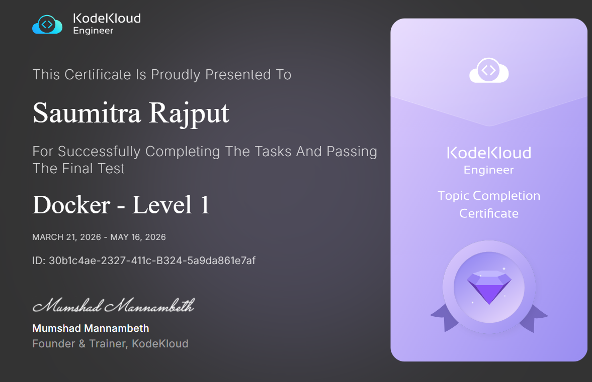

:shipit:

## Task  1


The Nautilus DevOps team is testing some applications deployment on some of the application servers. They need to deploy a nginx container on Application Server 1. Please complete the task as per details given below:


On Application Server 1 create a container named nginx_1 using image nginx with alpine tag and make sure container is in running state.

## Solution

## Commands Used

```
docker run -d --name xyx image:tag
```
## What I Learned

## Notes

---

## Task 2

The Nautilus team wants to create a debug container on Application Server 1. However, they had some specific requirements related to the CMD. Please complete the task as per details given below:


a. On Application Server 1 create a container named debug_1 using image ubuntu/apache2:latest.

b. Overwrite the default CMD with command sleep 1000.

c. Make sure the container is in running state.
## Solution

## Commands Used

docker run -d --name xyz image:tag command
## What I Learned

## Notes
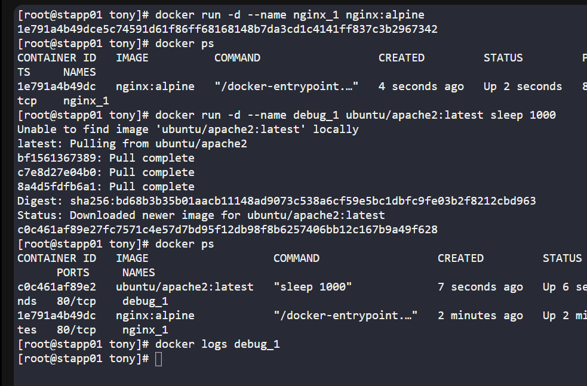

---

## Task 3

We received a request to copy some of the data from one of the docker containers to the docker host. The container is running on App Server 1 in Stratos Datacenter. Below are more details about the task:


On App Server 1 in Stratos Datacenter copy an encrypted file /tmp/test.txt.gpg from development_3 docker container to the docker host in /tmp location. Please do not try to modify this file in any way.
## Solution

## Commands Used

docker cp source  container_name:path

docker cp container_name:source  local_host_as_dest

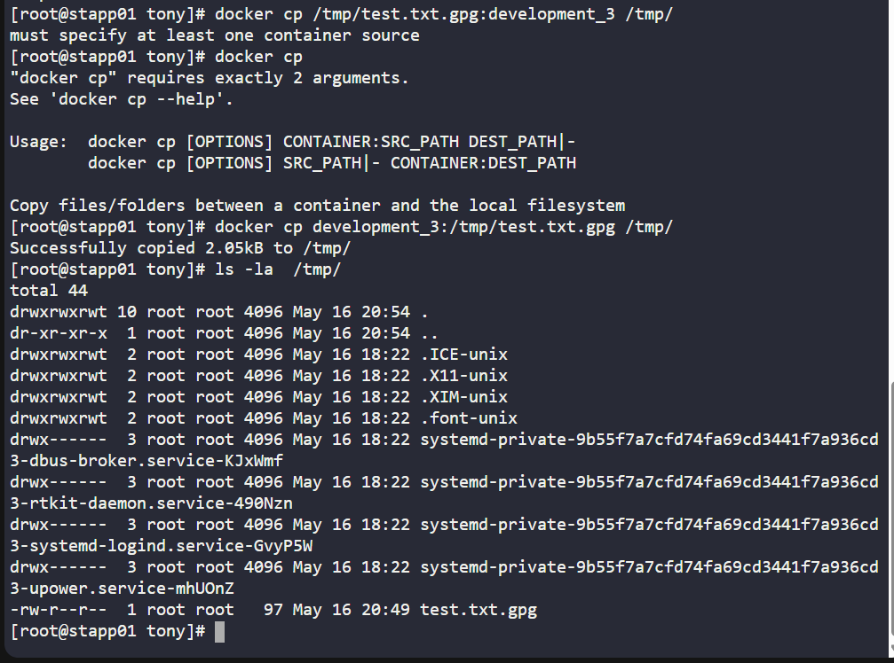
## What I Learned

## Notes

---

## Task 4
The Nautilus DevOps team has some confidential data present on App Server 1 in Stratos Datacenter. There is a container ubuntu_latest running on the same server. We received a request to copy some of the data from the docker host to the container. Below are more details about the task:


On App Server 1 in Stratos Datacenter copy an encrypted file /tmp/nautilus.txt.gpg from docker host to ubuntu_latest container (running on same server) in /home/ location (create this location if doesn't exit). Please do not try to modify this file in any way.
## Solution

## Commands Used

docker cp /tmp/nautilus.txt.gpg ubuntu_latest:/home/


docker exec ubuntu_latest ls -la /home/

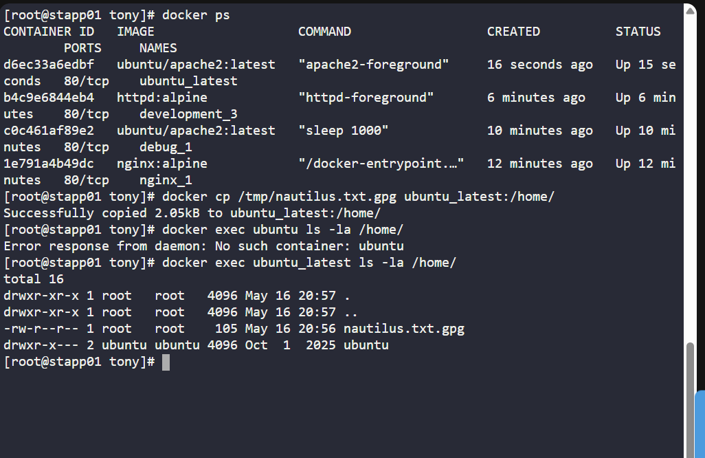
## What I Learned

## Notes

---

## Task 5
The DevOps team is performing some cleanup on all app servers in Stratos DC. They want to clean up some unwanted docker images from these servers, some images might be in use by some docker containers, but those containers are not in use so we need to clean those containers and the images. Below are the images that need to be deleted from Application Server 1:


a. alpine:3.18.4

b. sebp/lighttpd:latest
## Solution

## Commands Used
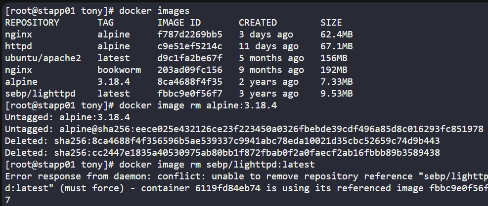

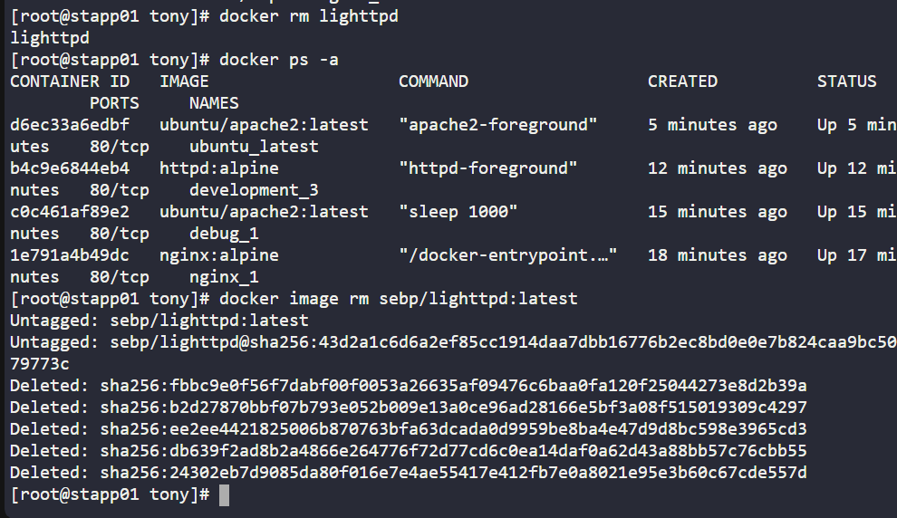
## What I Learned

## Notes

---

## Task 6
The Nautilus DevOps team is doing some cleanup work on all servers in Stratos DC. They were also looking for some unwanted and heavy docker images if present and can be cleaned.


On App Server 1 in Stratos Datacenter look for the docker images with size more than 100MB, delete all such docker images.
## Solution

## Commands Used

```
docker images
docker ps -a
docker stop contname or ID | docker rm containername
docker image rm ubuntu/apache2:latest nginx:bookworm
```

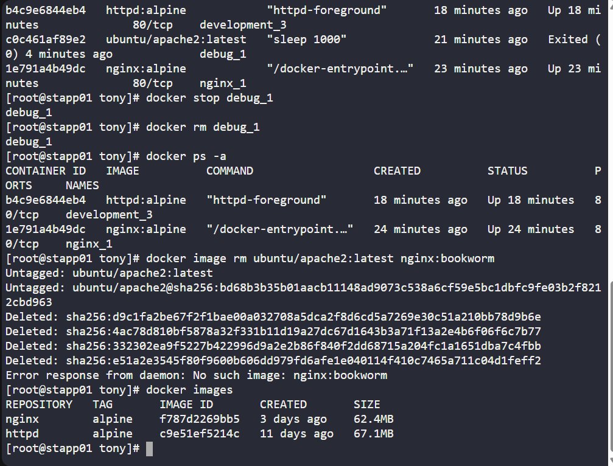
## What I Learned

## Notes

---

## Task 7
The Nautilus DevOps team is planning to setup/create some docker containers on App Server 1 in Stratos Datacenter, some prerequisites are needs to be done on this server. Find below more details:


Create a new network named mysql-network using the bridge driver. Allocate subnet 182.18.0.0/24, configure Gateway 182.18.0.1.
## Solution

## Commands Used
```

docker network ls
docker network

docker network create mysql-network --driver bridge --subnet 182.18.0.0/24 --gateway 182.18.0.1
docker network inspect mysql-network
```

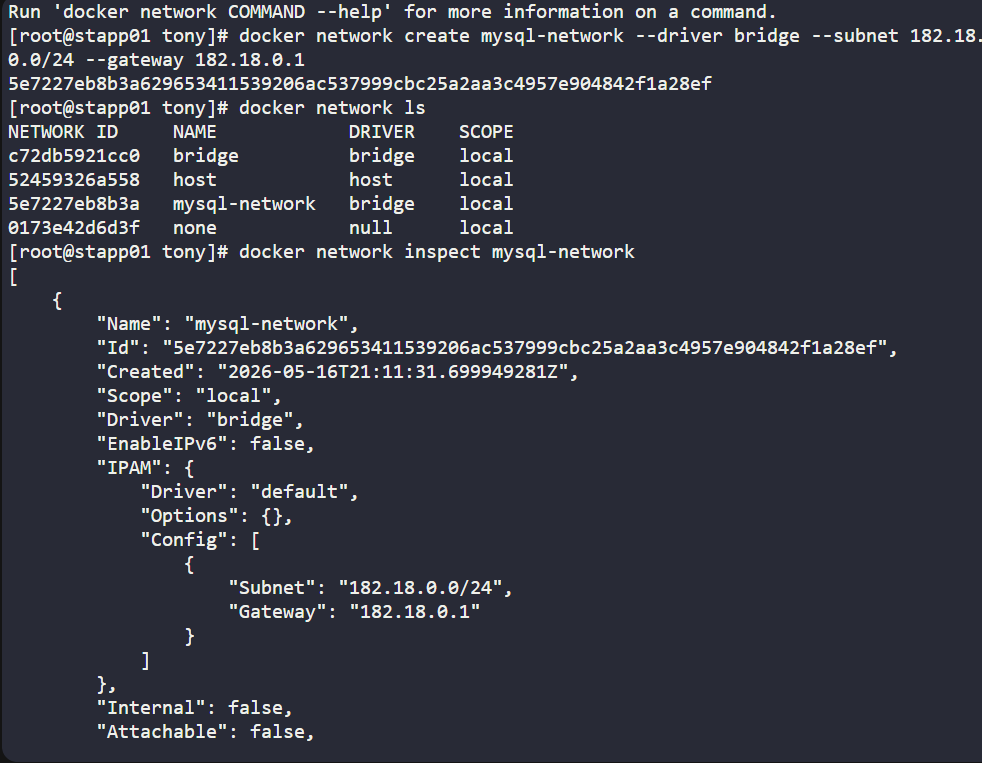
## What I Learned

## Notes

---

## Task 8

The Nautilus DevOps team is planning to do some cleanup on App Server 1 in Stratos Datacenter, some old and unused docker networks need to be deleted. Find below more details:


Delete a docker network named php-network from App Server 1 in Stratos Datacenter.

## Solution

## Commands Used
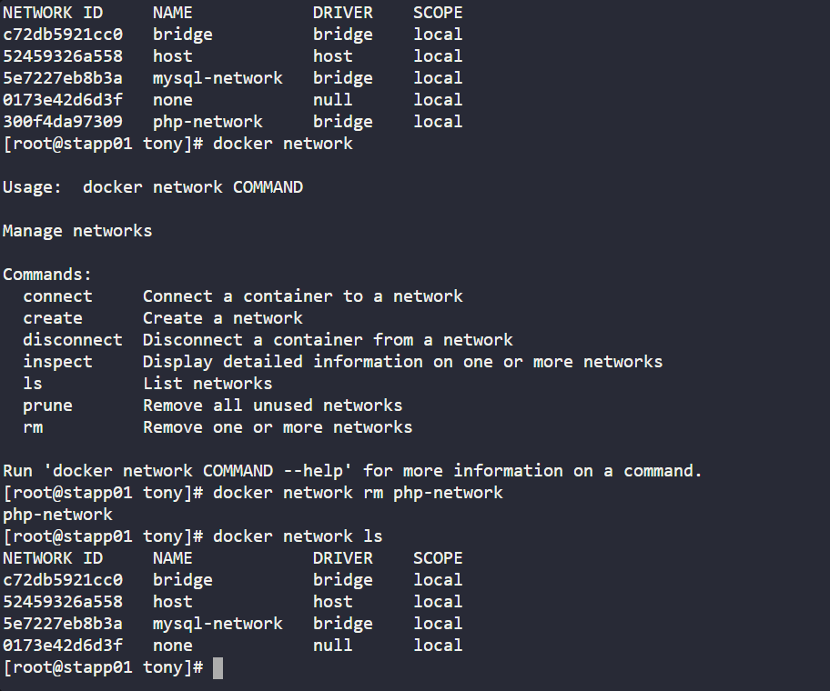
## What I Learned

## Notes

---

## Task 9
There were some containers created by the DevOps team on App Server 1 in Stratos DC, and those were running fine till yesterday. Team found that those containers were exited somehow today, look into the issue and make sure all containers are in running state. Below is the name of two containers which were exited:


a. lab1_container
b. lab2_container
## Solution

## Commands Used
docker start cont1 
docker start cont2

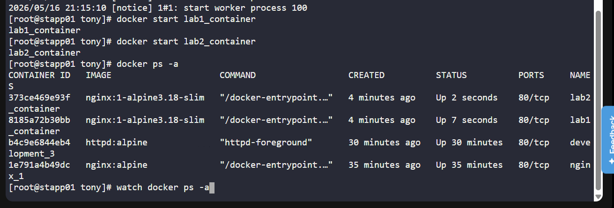
## What I Learned

## Notes


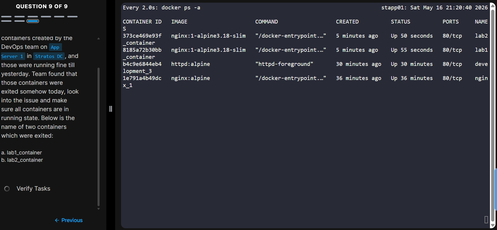


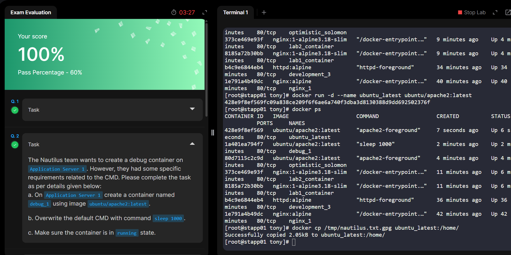