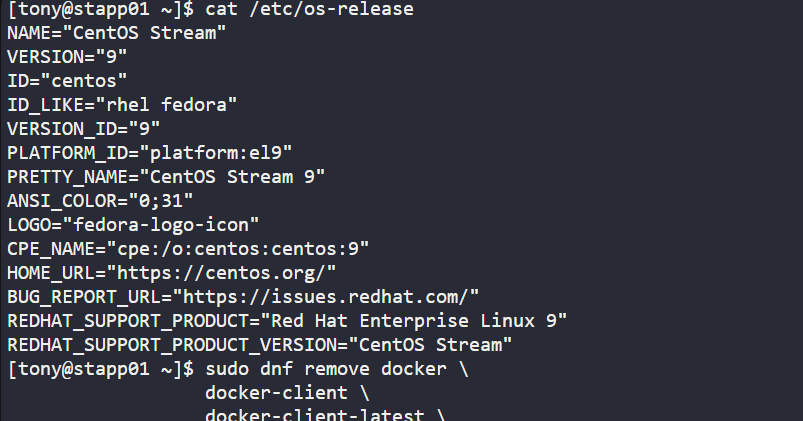
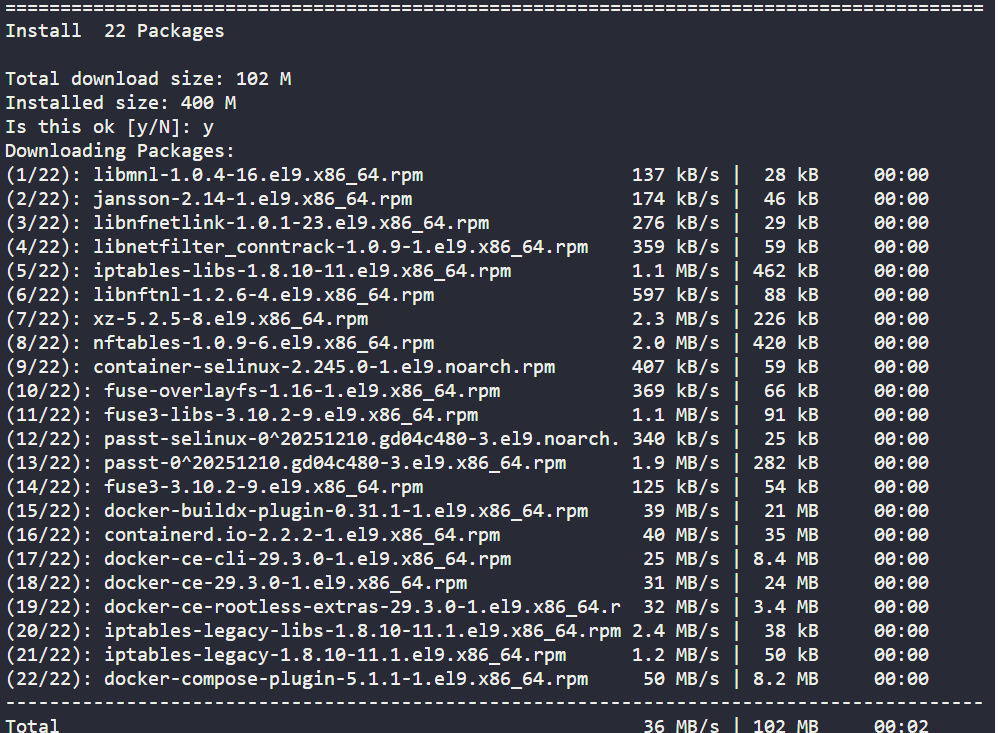
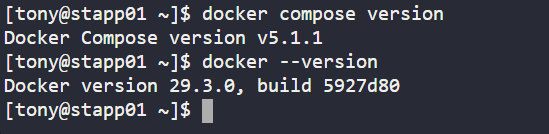
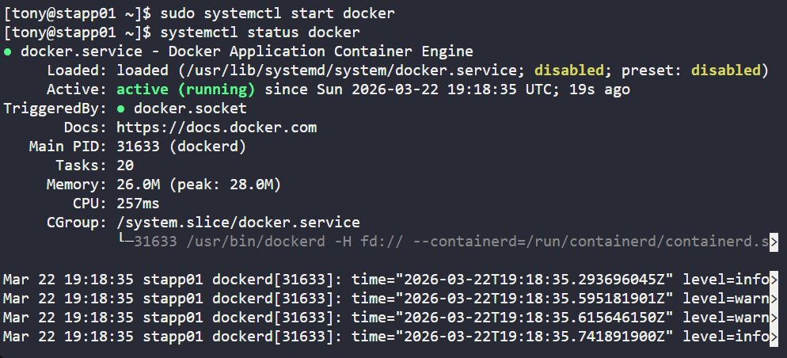
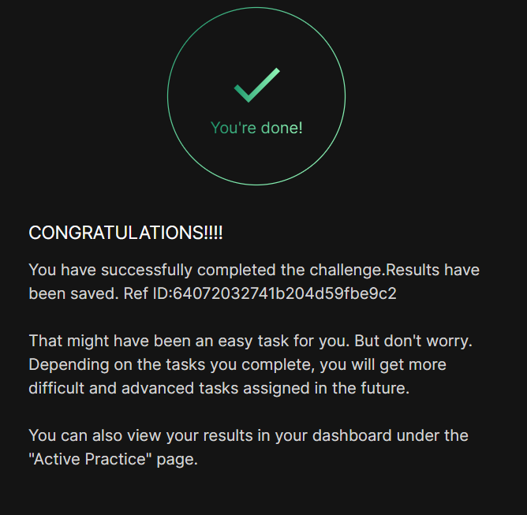

# Day 01
:shipit:

## Task
The Nautilus DevOps team aims to containerize various applications following a recent meeting with the application development team. They intend to conduct testing with the following steps:

Install docker-ce and docker compose packages on App Server 1.

Initiate the docker service.

## Solution

ssh into the server and check the os
- 

installed the docker-ce for centos from official docs [LINK](https://docs.docker.com/engine/install/centos/)
- 

installation completed
- 

check the docker status and only started the docker
- 


## Commands Used

```
yum install -y yum-utils
yum-config-manager --add-repo https://download.docker.com/linux/centos/docker-ce.repo
yum install -y docker-ce docker-compose-plugin
systemctl start docker
```

## What I Learned

- `docker-ce` is installed from Docker’s official repository, not the default CentOS repository.
- `yum-utils` provides the `yum-config-manager` command, which is used to add external repositories.
- `docker-compose-plugin` enables Docker Compose support using the `docker compose` command.
- The Docker service must be started after installation before Docker commands can be used.
- `systemctl start docker` starts the Docker service immediately.
- `systemctl enable docker` is only needed if Docker should start automatically after reboot.

## Notes

- Added Docker’s official CentOS repository before installing Docker packages.
- Installed both `docker-ce` and `docker-compose-plugin`.
- Started the Docker service successfully.
- Enabling the Docker service was not required because the task only asked to initiate the service.



