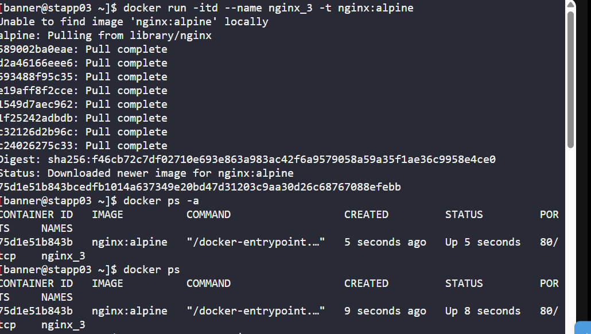
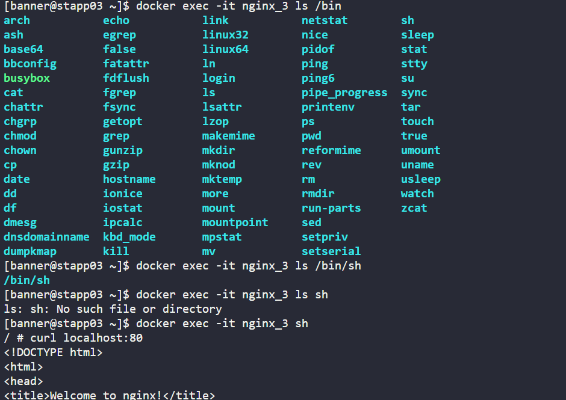
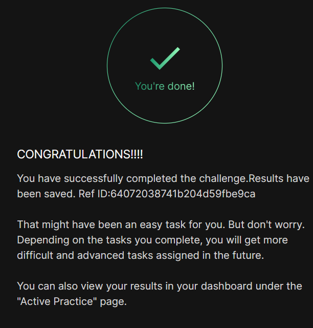

# Day 02
:shipit:

## Task
The Nautilus DevOps team is conducting application deployment tests on selected application servers. They require a nginx container deployment on Application Server 3. Complete the task with the following instructions:

On Application Server 3 create a container named nginx_3 using the nginx image with the alpine tag. Ensure container is in a running state.
## Solution

image created and running
- 

exec into the container and curl localhost:80
- 
## Commands Used
```
docker run -itd --name nginx_3 -t nginx:alpine
docker ps -a
docker ps
curl localhost:80 | wc -l
docker exec nginx_3 bash
docker images
docker exec -it nginx_3 bash
docker exec -it nginx_3 ls /bin
docker exec -it nginx_3 ls /bin/sh
docker exec -it nginx_3 sh
curl localhost:80
```
## What I Learned

## Notes



