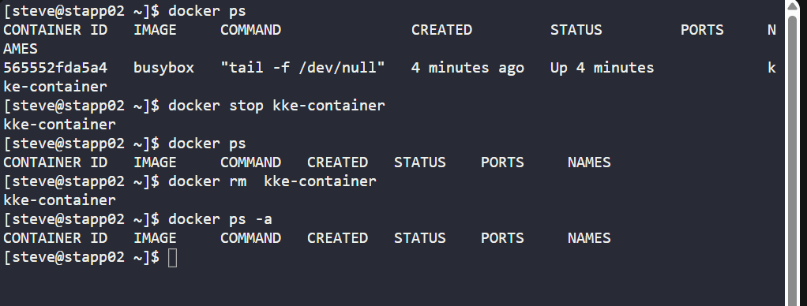
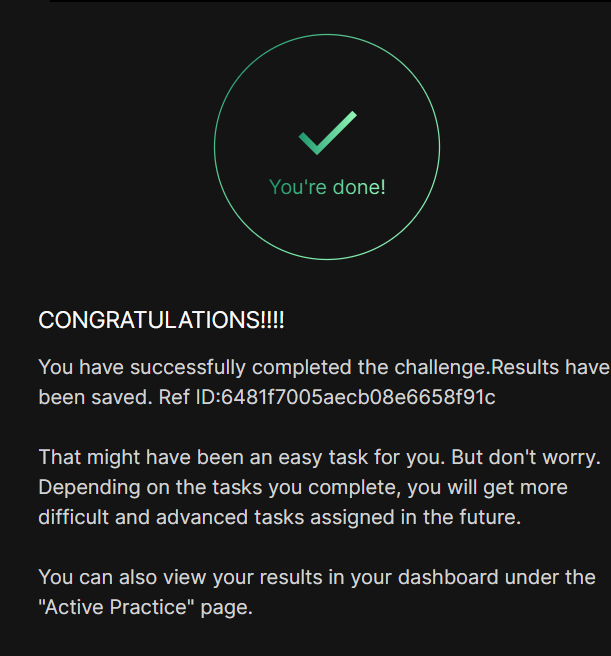

# Day 03
:shipit:

## Task

A container named kke-container was created by one of the Nautilus project developers on App Server 2. It was solely for testing purposes and now requires deletion. Execute the following task:

Delete the kke-container on App Server 2 in Stratos DC.

## Solution

## Commands Used

## What I Learned

## Notes

