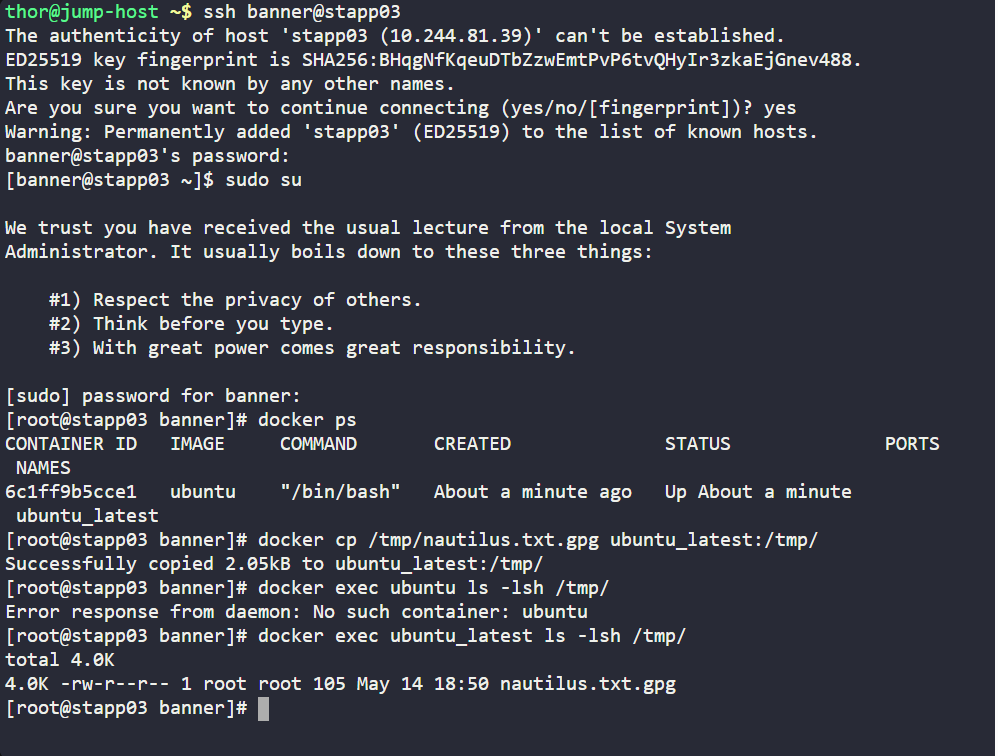
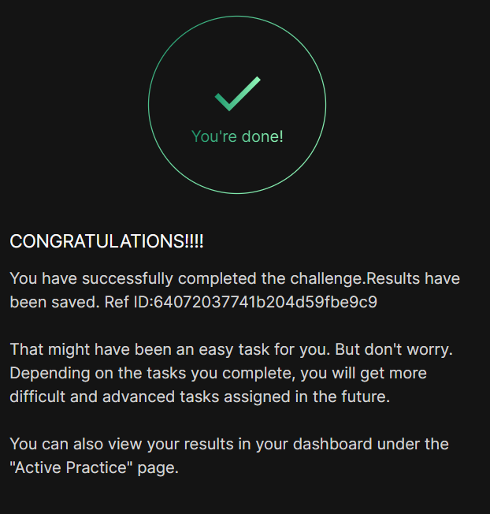

# Day 04
:shipit:

## Task
The Nautilus DevOps team possesses confidential data on App Server 3 in the Stratos Datacenter. A container named ubuntu_latest is running on the same server.


Copy an encrypted file /tmp/nautilus.txt.gpg from the docker host to the ubuntu_latest container located at /tmp/. Ensure the file is not modified during this operation.

## Solution

## Commands Used


```
[root@stapp03 banner]# history
    1  docker ps
    2  docker cp /tmp/nautilus.txt.gpg ubuntu_latest:/tmp/
    3  docker exec ubuntu ls -lsh /tmp/
    4  docker exec ubuntu_latest ls -lsh /tmp/
    5  history
[root@stapp03 banner]# 
```
## What I Learned

## Notes


