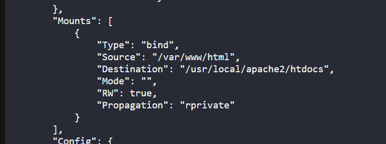
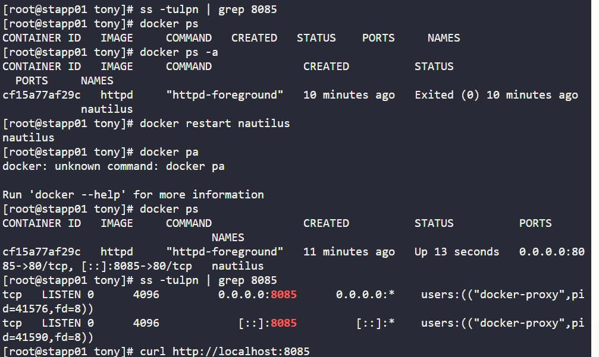
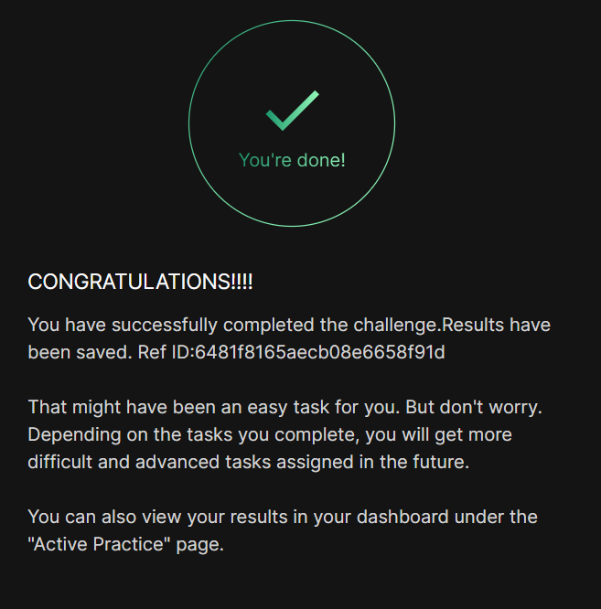

# Day 05
:shipit:

## Task

An issue has arisen with a static website running in a container named nautilus on App Server 1. To resolve the issue, investigate the following details:


Check if the container's volume /usr/local/apache2/htdocs is correctly mapped with the host's volume /var/www/html.

Verify that the website is accessible on host port 8085 on App Server 1. Confirm that the command curl http://localhost:8085/ works on App Server 1.
## Solution


## Commands Used

```
docker ps -a          # Lists all containers (running and stopped)
docker logs nautilus  # Shows the error logs for the nautilus container
docker inspect nautilus # Views full configuration data of the container
docker restart nautilus # Restarts the container to apply changes

curl http://localhost:8085/  # Sends a web request to test the app


sudo yum update -y          # Updates your system packages safely
sudo yum install iproute -y # Installs 'ss' (on older CentOS, it is 'iproute')

```






## What I Learned

## Notes
