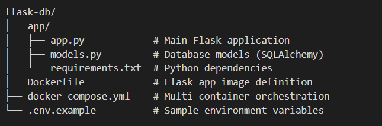

🐳 Flask + Database App (Docker Compose)

A simple web application built with Python Flask and a PostgreSQL (or MySQL) database, fully containerized using Docker Compose. This project demonstrates a minimal but production-ready setup for running a Flask API with a persistent database backend.

📖 What the App Does


Exposes a RESTful API via Flask running on port 5000


Connects to a relational database (PostgreSQL) for persistent data storage


Supports basic CRUD operations on a data model


Uses Docker Compose to orchestrate the Flask app and database as separate, linked containers

🗂 Project Structure



🚀 How to Run with Docker Compose

Prerequisites


Docker installed (v20+)


Docker Compose installed (v2+)

Steps

1. Clone the repository

```

git clone https://github.com/saumitra-rajput/my-docker.git
cd my-docker/projects/flask-db
```
2. Set up environment variables

```

cp .env.example .env
# Edit .env with your preferred values
```
3. Build and start the containers

```
docker compose up --build
```
4. Access the app

Open your browser or use curl:
```
http://localhost:5000
```
5. Stop the containers

```

docker compose down
```
To also remove volumes (wipes database data):

```
docker compose down -v
```

